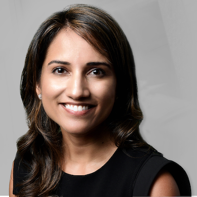

			
Leonard A. Lauder Assistant Professor of Ophthalmology

Edward S. Harkness Eye Institute

Columbia University Irving Medical Center

Dr. Shukla currently serves as the Leonard A. Lauder Assistant Professor of Ophthalmology at Columbia University Medical Center and Attending Ophthalmologist at the New York Presbyterian Hospital. She completed her undergraduate education as a Trustee and Renaissance Scholar at the University of Southern California. She received her medical degree at Columbia University College of Physicians & Surgeons, where she was awarded a Doris Duke Clinical Research Fellowship and earned the Edith and Denton McKane Memorial Award for Outstanding Research in Ophthalmology and later completed her ophthalmology residency and served as Chief Resident. She pursued further glaucoma subspecialty training at the Wilmer Eye Institute at Johns Hopkins University in Baltimore, MD. 

Dr. Shukla is a board-certified ophthalmologist and specializes in the medical and surgical management of glaucoma and cataracts. Her surgical expertise includes minimally invasive glaucoma surgery, traditional glaucoma surgery, glaucoma laser surgery, and cataract surgery.  Her main research interests include the early detection of glaucoma, structure-function relationships in glaucoma, and optimizing surgical outcomes. She is continually inspired by her patients and aims to improve their quality of life while treating their eye conditions.

Dr. Shukla has published numerous peer-reviewed articles, book chapters, and has been invited to speak nationally and internationally on patient care and research. She has been recognized by her peers by appointment to the editorial board of Ophthalmology Glaucoma and has received research grants and several awards, including the American Glaucoma Society (AGS) Mentoring for Advancement of Physician Scientists Grant and the American Academy of Ophthalmology (AAO) Best Paper Award and Secretariat Award. She was awarded the American Society of Cataract and Refractive Surgery (ASCRS) International Service Grant for her involvement in global health initiatives.

Credentials
Board Certification - American Board of Ophthalmology: 2019

Education
Fellowship: Wilmer Eye Institute, Glaucoma: 2018-2019
Residency: Chief Resident–Harkness Eye Institute, Columbia University Medical Center: 2015-2018
Medical School: Columbia University College of Physicians and Surgeons: 2009-2014
Undergraduate: University of Southern California: 2005–2009