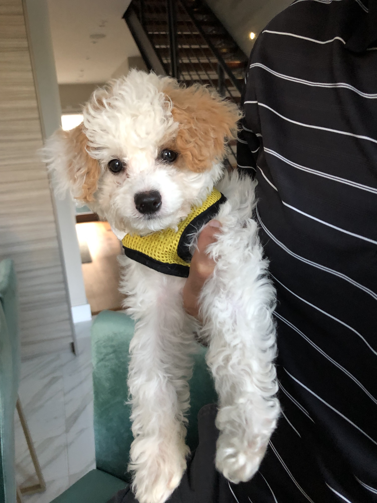

```{r setup, include=FALSE}
knitr::opts_chunk$set(echo = TRUE)
```
Welcome to Aakriti Shukla's website for p8105!

Aakriti is an ophthalmologist at CUIMC and is taking the p8105 Data Science class. 


Here's a link to Aakriti's [academic and professional experience](index-hw4.html).

Here's a link to [contact](contact.html) Aakriti.

Here's a link to Aakriti's [repositories](repositories.html).

Here is a picture of Aakriti's pet puppy, Sugar. 



